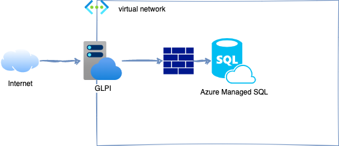

# :large_blue_circle: GLPI 10.x hébergé sur Azure App Service



- [:large\_blue\_circle: GLPI 10.x hébergé sur Azure App Service](#large_blue_circle-glpi-10x-hébergé-sur-azure-app-service)
  - [:clipboard: Prérequis](#clipboard-prérequis)
  - [:wrench: Comment déployer son instance](#wrench-comment-déployer-son-instance)


## :clipboard: Prérequis

- un compte Azure
- terraform dernière version disponible

## :wrench: Comment déployer son instance

``` bash
git clone https://github.com/fabienchevalier/glpi-on-azure-appservices.git && cd terraform
terraform init
terraform apply
```

Renseigner le FQDN de la BDD indiqué dans l'output, ainsi que le mot de passe, avec le login `mysqladmin`.