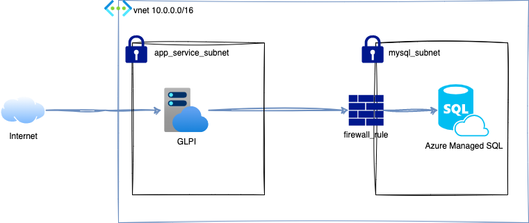

# :large_blue_circle: GLPI 10.x hébergé sur Azure App Service



:warning: **Ne fonctionne pas en l'état. POC en cours de réalisation**

- [:large\_blue\_circle: GLPI 10.x hébergé sur Azure App Service](#large_blue_circle-glpi-10x-hébergé-sur-azure-app-service)
  - [:clipboard: Prérequis](#clipboard-prérequis)
  - [:wrench: Comment déployer son instance](#wrench-comment-déployer-son-instance)
  - [:pushpin: Divers](#pushpin-divers)


## :clipboard: Prérequis

- un compte Azure
- terraform dernière version disponible

## :wrench: Comment déployer son instance

``` bash
git clone https://github.com/fabienchevalier/glpi-on-azure-appservices.git && cd terraform
terraform init
terraform apply
```

Renseigner le nom de la BDD indiqué dans l'output, ainsi que le mot de passe, avec le login `mysqladmin` lors de la première configuration de GLPI.

## :pushpin: Divers

Le plan App Service provisinné est B1, soit approximativement 50 euros par mois. Ne pas oublier de détruire l'infrastructure (`terraform destroy`) une fois les tests validés afin de ne pas engendrer des coûts supplémentaires. La raison étant que le plan gratuit ne supporte pas l'intégration de l'app à un VPC, ici nécessaire pour rendre innaccessible la base de données en dehors de notre compte Azure.

